# DEV-PLAN — Personal Blog MVP

> 按 IdeaHammer `dev-planner` 产出：每个 Work Item（WI）独立验收 = 1 commit

---

## 0. 目标

按 8 步流水线 product-spec → design → plan → dev → test → review → PR 跑通 MVP：
**7 端点 + 3 模型 + 21 测试**，最后真 commit + 真 push + 真 PR 描述。

## 1. 范围（来自 Spec §2.2）

7 端点 = 博客 CRUD(5) + 评论(2) + 点赞点踩(1) + 置顶(1) + 删除评论(1) **= 实际 9 端点**

| ID | 端点 | Spec |
|----|------|------|
| EP-1 | POST /api/posts | F-2.1 |
| EP-2 | GET /api/posts | F-2.2 |
| EP-3 | GET /api/posts/{id_or_slug} | F-2.3 |
| EP-4 | PUT /api/posts/{id} | F-2.4 |
| EP-5 | DELETE /api/posts/{id} | F-2.5 |
| EP-6 | POST /api/posts/{id}/comments | F-2.6 |
| EP-7 | POST /api/posts/{id}/react | F-2.7 |
| EP-8 | PATCH /api/posts/{id}/pin | F-2.8 |
| EP-9 | DELETE /api/comments/{id} | F-2.9 |

---

## 2. WI 拆解

每 WI 一个 commit。**先 RED，再 GREEN**。

### WI-1 · 项目骨架（脚手架）

| 项 | 详情 |
|---|---|
| **做什么** | `pyproject.toml` + `app/main.py` + `app/db.py` + `app/models/__init__.py` + `tests/conftest.py` + `app/api/health.py` + `/api/health` |
| **依赖** | 无 |
| **完成标准** | `uv run uvicorn app.main:app` 起服务；`curl /api/health` 返回 `{status: "ok"}`；`pytest` 跑通 1 个 health 测试 |
| **TDD** | 先写 `test_health.py::test_health_endpoint_returns_ok_status`，跑 FAILED，再写实现 |
| **Commit** | `feat(blog): 项目骨架 + health endpoint` |
| **预估** | 10 分钟 |

### WI-2 · Post 模型 + CRUD（5 端点 + 测试）

| 项 | 详情 |
|---|---|
| **做什么** | `app/models/post.py` (Post ORM) + `app/api/posts.py` (EP-1 ~ EP-5 + EP-8) + `tests/test_posts.py` |
| **依赖** | WI-1 |
| **完成标准** | 9 个测试全绿（CRUD + 422 + 404 + 置顶优先排序 + slug 唯一性） |
| **TDD 纪律** | 先 9 个 RED（建文件即失败因为端点不存在），再写实现，再 GREEN，再 REFACTOR 抽 helper |
| **Commit** | `feat(blog): Post 模型 + 5 CRUD 端点 + 置顶（9 测试）` |
| **预估** | 25 分钟 |

### WI-3 · Comment 模型 + 端点（2 端点）

| 项 | 详情 |
|---|---|
| **做什么** | `app/models/comment.py` + `app/api/comments.py` (EP-6 + EP-9) + `tests/test_comments.py` |
| **依赖** | WI-2（需要 post_id 外键） |
| **完成标准** | 5 个测试全绿（创建 + 422 空内容 + 404 博客不存在 + 删除 + 级联删除） |
| **Commit** | `feat(blog): Comment 模型 + 创建/删除端点（5 测试）` |
| **预估** | 15 分钟 |

### WI-4 · Reaction 模型 + 端点（点赞点踩防重复）

| 项 | 详情 |
|---|---|
| **做什么** | `app/models/reaction.py` + `app/api/reactions.py` (EP-7) + `tests/test_reactions.py` |
| **依赖** | WI-3 |
| **完成标准** | 4 个测试全绿（点赞 + 点踩 + 同 IP 重复点赞不变计数 + 切换 type） |
| **Commit** | `feat(blog): Reaction 模型 + 点赞点踩防重复（4 测试）` |
| **预估** | 15 分钟 |

### WI-5 · 详情端点（聚合评论 + 点赞数）

| 项 | 详情 |
|---|---|
| **做什么** | 修改 `GET /api/posts/{id_or_slug}` 端点，join 拉评论列表 + 点赞/点踩 count |
| **依赖** | WI-3 + WI-4 |
| **完成标准** | 3 个测试（详情含评论 + 含点赞数 + slug 查询） |
| **Commit** | `feat(blog): 详情端点聚合评论 + 点赞计数（3 测试）` |
| **预估** | 10 分钟 |

### WI-6 · code-reviewer spawn（两阶段审查）

| 项 | 详情 |
|---|---|
| **做什么** | 跑完 WI-5 → spawn code-reviewer.toml（两阶段审查） |
| **依赖** | WI-1 ~ WI-5 全绿 |
| **完成标准** | Stage 1 完整性 ✅ / Stage 2 质量 ✅（含工程级约束 + simplification） |
| **产物** | `Code-Review-Report.md`（真审查产出） |
| **预估** | 5 分钟 |

### WI-7 · PR 描述 + 推送

| 项 | 详情 |
|---|---|
| **做什么** | 写 `PR-Description.md`（实际 PR 描述）+ push 双 remote + 给 commit 链列表 |
| **依赖** | WI-6 通过 |
| **完成标准** | GitHub 上看到 6 个 commit + 21 测试全绿 |
| **预估** | 5 分钟 |

---

## 3. 串并行图

```mermaid
gantt
    title WI 串并行
    dateFormat HH:mm
    section 后端
    WI-1 骨架         :a1, 00:00, 10m
    WI-2 Post CRUD    :a2, after a1, 25m
    WI-3 Comment      :a3, after a2, 15m
    WI-4 Reaction     :a4, after a3, 15m
    WI-5 详情聚合     :a5, after a4, 10m
    section 审查+发布
    WI-6 code-review  :crit, a6, after a5, 5m
    WI-7 PR + push    :a7, after a6, 5m
```

**预计总耗时：75 分钟**（含审查）

---

## 4. 测试策略

| 层级 | 工具 | 覆盖 |
|------|------|------|
| 单元 | pytest | 服务层 helper（slug 生成、reaction 防重） |
| 集成 | pytest + TestClient | 9 个端点（21 测试） |
| 端到端 | 手动 | clone → uv sync → pytest → uvicorn → 浏览器 |

**TDD 铁律**：每个 WI 必先 RED（看到 FAILED 才能进 GREEN）。

---

## 5. 风险与缓解

| 风险 | 缓解 |
|------|------|
| slug 冲突（title 重） | slug 加 `-{id}` 后缀 |
| 同 IP 重复点赞 | `UNIQUE(post_id, ip)` 数据库约束 |
| 评论删除后博客评论数显示不一致 | join 时实时 count（性能允许） |
| SQLite 文件没自动建表 | lifespan 启动 `create_all` |
| 已有 SQLite 文件不兼容 | dev 阶段一次性 db，**无迁移场景**（v0 不涉及） |

---

## 6. 验收门（Phase 整体完成）

- [ ] 21 测试全绿
- [ ] `curl /api/health` 返回 ok
- [ ] `curl POST /api/posts` 创建一篇
- [ ] `curl GET /api/posts` 返回该博客
- [ ] `curl POST /api/posts/1/comments` 加评论
- [ ] `curl POST /api/posts/1/react {type:"up"}` 点赞
- [ ] 6 commit 全部 push 到双 remote
- [ ] Code-Review-Report.md 写入 examples/personal-blog/
- [ ] PR-Description.md 写入 examples/personal-blog/

---

## 7. 不在 Phase 1 的"以后做"

- **v1.0**：登录 / Markdown / 评论审核 / 标签 / 搜索 / RSS
- **v1.5**：多用户 / 通知 / 邮件订阅
- **永远不做**：广告 / 联盟营销 / 内容付费

---

<!-- owner: architecture -->