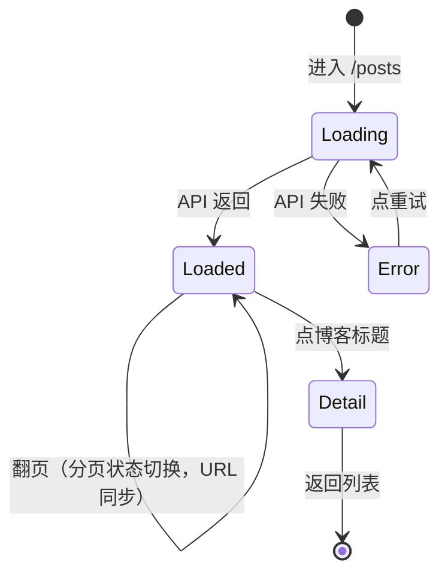
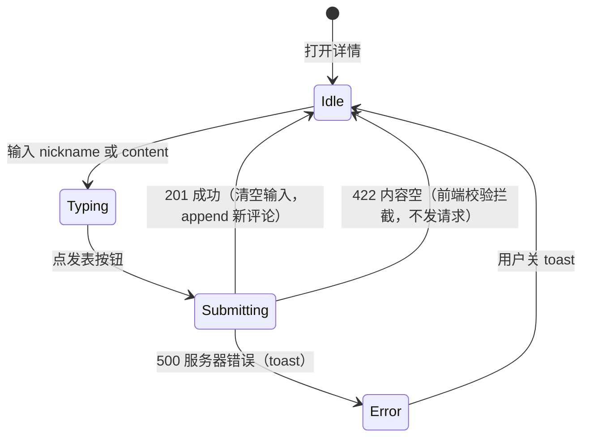
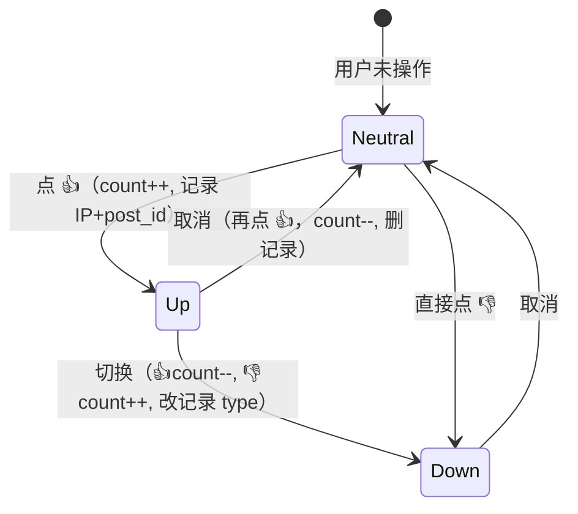

# Design Brief — Personal Blog MVP

> 按 IdeaHammer `design-brief-builder` 产出（无设计稿场景）
> 视觉策略：**沿用 Element Plus 复用**，不做新组件

---

## 1. 设计原则（按优先级）

1. **UI 一律以 Spec 为准**（无设计稿，继承 Element Plus 复用模式）
2. **3 分钟上手**：访客 3 分钟内能完成"看列表 → 看详情 → 评论 + 点赞"
3. **作者后台不暴露**：无登录 UI（v0 用 header token / IP 白名单保护管理端）
4. **零认知负担**：作者不学 Markdown（v1），直接 textarea 写；访客不学 emoji

---

## 2. 路由信息架构

### 2.1 路由清单

```text
/                       首页（最新博客列表，置顶在前）
/posts                  列表页（分页）
/posts/:id              详情页（评论 + 点赞 + 点踩）
/admin                  管理后台（v0 用 token 保护）
/admin/new              写博客
/admin/posts/:id/edit   编辑博客
```

### 2.2 关键页面 wireframe（文字版）

**列表页**：

```
┌──────────────────────────────────────┐
│ [📌 置顶] 我的 IdeaHammer 实战        │  ← is_pinned=true, 红色背景
│ 摘要 · 评论 12 · 👍 30 👎 2 · 2h ago  │
├──────────────────────────────────────┤
│ Phase 0 商业可行性 5 问快筛          │
│ 摘要 · 评论 3 · 👍 8 👎 0 · 1d ago   │
├──────────────────────────────────────┤
│ Phase 1.5 竞品扫描实战                │
│ 摘要 · 评论 0 · 👍 1 👎 0 · 2d ago   │
└──────────────────────────────────────┘
              [上一页] 1 / 3 [下一页]
```

**详情页**：

```
┌──────────────────────────────────────┐
│ Phase 0 商业可行性 5 问快筛          │
│ 发布于 2026-09-29 · 评论 3 · 👍 8    │
├──────────────────────────────────────┤
│ 内容正文 ...                          │
├──────────────────────────────────────┤
│ [👍 8]  [👎 0]   ← 点击切换          │
├──────────────────────────────────────┤
│ 💬 评论 (3)                           │
│   ─ alice: 666                       │
│   ─ bob:  学到了                     │
│   ─ carol: 追问 pre-mortem           │
├──────────────────────────────────────┤
│ [nickname:_____] [content:_______]   │
│                              [发表]   │
└──────────────────────────────────────┘
```

---

## 3. 状态机

### 3.1 博客列表状态机



### 3.2 评论交互状态机



### 3.3 点赞状态机（防重复）



---

## 4. 反 UI 假设（明确拒绝的方案）

### 4.1 ❌ 反假设 1：评论要分页

错：博客评论 90% < 10 条，分页只是给读者找麻烦。

**正确**：评论一次性全加载（v0），> 50 条考虑分页。

### 4.2 ❌ 反假设 2：博客正文要支持富文本编辑器

错：富文本编辑器 = 200KB + 复杂状态 + XSS 风险。

**正确**：v0 用 textarea 写纯文本（存原文），v1 再引入 markdown-it + DOMPurify。

### 4.3 ❌ 反假设 3：点赞要带动画

错：动画分散阅读注意力，且开发成本不低。

**正确**：数字直接 +1/-1，无动画。

### 4.4 ❌ 反假设 4：管理后台要登录

错：MVP 单用户，加登录 = 2 表 + JWT + 找回密码 = 翻倍工作量。

**正确**：v0 用固定 token（环境变量 ADMIN_TOKEN），前端 localStorage 存；
v1 再加简单密码登录。

---

## 5. 数据模型（与 Spec §2.2 对应）

```sql
-- posts 博客
CREATE TABLE posts (
    id INTEGER PRIMARY KEY AUTOINCREMENT,
    title TEXT NOT NULL,
    slug TEXT UNIQUE NOT NULL,  -- 自动从 title 生成，URL 用
    content TEXT NOT NULL,
    is_pinned BOOLEAN DEFAULT 0,
    created_at DATETIME DEFAULT CURRENT_TIMESTAMP,
    updated_at DATETIME DEFAULT CURRENT_TIMESTAMP
);
CREATE INDEX idx_posts_pinned ON posts(is_pinned DESC, created_at DESC);

-- comments 评论
CREATE TABLE comments (
    id INTEGER PRIMARY KEY AUTOINCREMENT,
    post_id INTEGER NOT NULL REFERENCES posts(id) ON DELETE CASCADE,
    nickname TEXT NOT NULL,
    content TEXT NOT NULL,
    created_at DATETIME DEFAULT CURRENT_TIMESTAMP
);
CREATE INDEX idx_comments_post ON comments(post_id, created_at);

-- reactions 点赞/点踩
CREATE TABLE reactions (
    id INTEGER PRIMARY KEY AUTOINCREMENT,
    post_id INTEGER NOT NULL REFERENCES posts(id) ON DELETE CASCADE,
    ip TEXT NOT NULL,           -- v0 简化：仅按 IP 防重复
    type TEXT NOT NULL CHECK(type IN ('up', 'down')),
    created_at DATETIME DEFAULT CURRENT_TIMESTAMP,
    UNIQUE(post_id, ip)         -- 同 IP 同博客只能 1 条
);
CREATE INDEX idx_reactions_post ON reactions(post_id, type);
```

**版本化**：本应用无业务数据变更（不是价格/规格/规则），v0 不引入 versioning-and-immutability（参考 `_engineering-constraints/database/versioning-and-immutability.md` 的判定标准）。

---

## 6. 视觉规范（沿用 Element Plus）

| 元素 | 选型 |
|------|------|
| 列表项 | `el-card` + 标题 `h3` + meta `h4` 灰色 |
| 置顶标识 | `el-tag type="danger"` 显示 `📌 置顶` |
| 点赞 / 点踩 | `el-button` + emoji + count；切换用 `el-radio-group` 或两个独立 button |
| 评论输入 | `el-input` + `el-button type="primary"` 发表 |
| 分页 | `el-pagination` |
| 管理后台 | `el-table` + `el-button` 编辑 / 删除 |
| 写博客 | `el-input` title + `el-input type="textarea" rows=20` content |
| Toast | `ElMessage.success/error` |

**理由**：Element Plus 复用策略（参考 flashcards 项目先例），不造新组件。

---

## 7. API 错误响应（统一）

| 状态码 | 含义 | 何时触发 |
|--------|------|---------|
| 200 | 成功 | 正常 GET / PUT / PATCH |
| 201 | 创建成功 | POST |
| 204 | 删除成功 | DELETE |
| 404 | 资源不存在 | GET / PUT / DELETE 不存在 id |
| 422 | 入参校验失败 | Pydantic 拦截 |
| 500 | 服务器错误 | DB / 异常 |

---

## 8. 可访问性 / i18n

- 所有按钮 `aria-label`
- 键盘可达：`Tab` + `Enter` 发评论，`1/2` 切换点赞点踩
- 文案中文（v0 不做 i18n）

---

<!-- owner: design -->