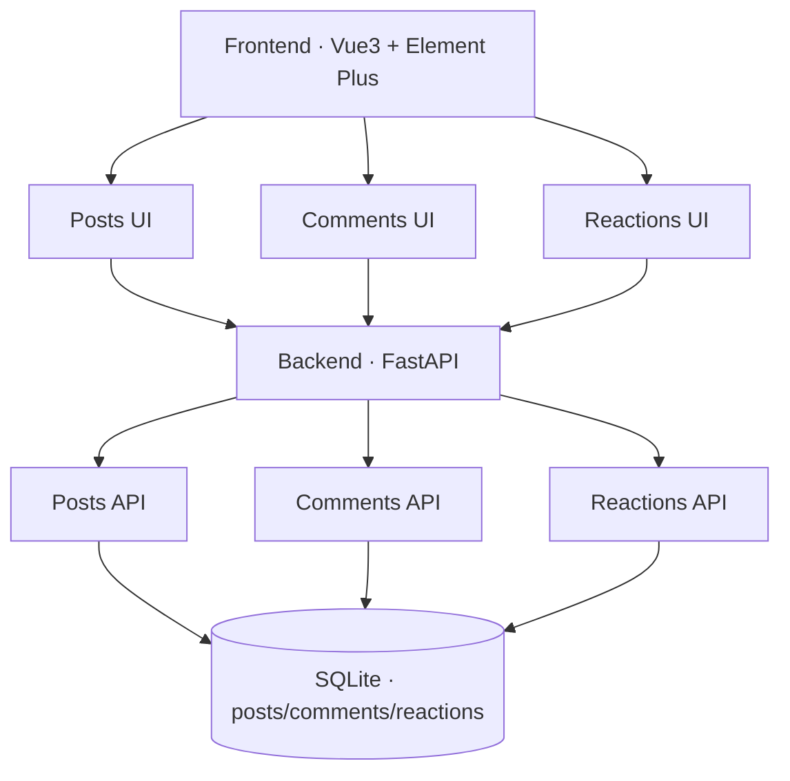

# 产品需求规范：Personal Blog（个人博客 MVP）

> 锚定 demo：`examples/personal-blog/`（按方法论从零到一真跑，非后补演示）
> 按 IdeaHammer 8 步流水线 **product-spec-builder** 产出，对齐 v0.8.0 模板节编号

---

## 文档元信息

| 字段 | 值 |
|---|---|
| 当前版本 | v1.0.0 |
| 核心干系人 | 产品：wuzhilong，研发：AI IDE + 个人 |
| 版本内容 | MVP 7 端点 + 评论 + 点赞点踩 + 置顶，演示 IdeaHammer 方法论的活工程 |
| 版本日期 | 2026-09-16 |

---

## 0. AI 使用说明

- 本文档是产品功能、范围、行为和验收标准的事实来源。
- AI MUST 优先实现 P0。
- AI MUST NOT 实现"不在本版本范围"中明确排除的内容。
- AI MUST 根据"验收标准"判断功能是否完成。
- 如果信息不明确，AI MUST 使用"假设"中的假设；如果仍无法判断，应记录到"待确认问题"，而不是自行扩展需求。

---

## 0.5 产品类型（驱动竞品扫描与范围权重）

| 字段 | 值 |
|---|---|
| 项目类型 | `业务参照型` |
| 判断依据 | 个人博客赛道属于公司既有"内容产出"业务线，问题域成熟（Hexo/Hugo/Halo/WordPress），重心在 §1.7 行业借鉴；产品本身不是"新市场机会型"产品，价值在于作品集演示 |

---

## 1. 产品上下文

### 1.1 产品摘要

- **是什么**：演示 IdeaHammer 方法论的活工程博客（FastAPI + Vue3 全栈）
- **为什么**：给面试官 3 分钟可验证的"AI Coding 真落地"作品集
- **怎么做**：7 端点 REST + SQLite + 纯前端，读 commit 链可见全过程

### 1.2 用户问题

开发者（尤其转型中的工程师）需要博客展示作品集，但主流方案（Hexo/Hugo 静态、Notion 平台化）要么无评论/无后台，要么内容被平台锁、迁移困难。无"作品集价值最大化"的一体化轻量方案。

### 1.3 目标用户

| 用户类型 | 描述 | 核心需求 |
|---|---|---|
| 作者（wuzhilong） | 3 年后端转型 AI Native，准备面试的开发者 | 快速发布 Markdown 博客、置顶、接收反馈 |
| 访客（面试官/读者） | 浏览博客、评论、点赞的技术读者 | 读博客 + 留评论 + 点赞反馈 |

### 1.4 核心价值

把博客作为简历配套的活工程展示（不是营销页），让面试官能在 3 分钟内看到"这个人真把 AI Coding 落地了"。作品集价值 > 产品功能价值。

### 1.4.1 系统功能架构



### 1.5 成功标准

| 判断标准 | 目标 / 信号 |
|---|---|
| 博客可即时发布并对外可访问 | 7 端点全部上线，作者能发布 → 访客能读 |
| 演示 IdeaHammer 方法论 | commit 链清晰可见每个 Phase 落地过程 |
| 面试官 3 分钟内能跑通 | clone → install → run ≤ 5 分钟 |

### 1.6 竞品扫描（≥ 2 直接竞品 + ≥ 2 替代方案）

| 类型 | 名字 | 解决什么 | 怎么收费 | 它的强 | 它的弱 | 我们凭什么 |
|---|---|---|---|---|---|---|
| 直接竞品 | Hexo / Hugo / Astro / VuePress | 静态博客生成器 | 免费 | 一行命令部署、托管免费、性能极佳 | 无评论（要接入第三方 Gitalk/Disqus）、无点赞、无后台管理 | 动态评论 + 点赞点踩 + 后台管理一体化 |
| 直接竞品 | Halo 2.x | 国产动态博客（Java + Vue3） | 免费 | Docker 一键部署、200+ 插件、社区活跃 | 学习曲线陡、Java 栈重、后台 UI 复杂 | 纯 Python 全栈轻量（FastAPI + Vue3）、代码 < 500 行可读完、IdeaHammer 演示价值 |
| 直接竞品 | WordPress | 老牌 PHP 博客 | 免费+付费插件 | 生态最大、插件最多 | PHP / 运维重、安全补丁频繁 | FastAPI 现代化栈、SQLite 零运维、3 分钟跑通 |
| 替代方案 | Notion + Super.so | Notion 当后端，前端套壳 | 订阅 | 写作 UI 好 | 评论弱、SEO 差、内容锁 Notion、迁移困难 | 自己后端、可导出 Markdown、纯自有 |
| 替代方案 | 掘金 / 知乎 / 公众号 | 平台发布 | 免费 | 流量大 | 内容被平台绑定、不能自定义域名、审核/封号风险 | 自有域名 + 数据 + 完全可控 |
| 替代方案 | GitHub Issues + Pages | 极客方案 | 免费 | 零成本 | 评论 = issues，技术门槛高 | 原生评论，零技术门槛 |

### 1.7 行业借鉴（≥ 2 顶级品类优秀做法）

| 来源产品/品类 | 借鉴维度 | 它的做法 | 我们怎么用 | 借鉴后的差异化风险 |
|---|---|---|---|---|
| 静态博客（Hexo/Hugo） | 工程 | 纯静态、零运维、Git 驱动内容 | 后端虽为动态，但写博客/版本管理走 Git 思维（commit 即版本） | 丢掉"动态评论/动态估值"——这是差异化主轴，不算风险 |
| Halo 2.x | 增长 | Docker 一键部署，README 一段命令跑通 | 个人博客 README 写明 `uv run uvicorn` 一行命令跑通 | 后台 UI 简化到最低限度，作者操作 = REST 直调 |
| Notion | 交互 | 块级编辑 + 即时预览 | v1 引入前端 markdown-it 实时预览（v0 不做） | v0 后端存原文不渲染，差异化保留到 v1 |
| Medium | 增长 | 点赞/鼓掌等轻量反馈 | 借鉴"轻量反馈"思路，做点赞 + 点踩两种反应而非单一打分 |

---

## 2. 范围

### 2.1 本版本范围

| 编号 | 内容 | 优先级 | 备注 |
|---|---|---|---|
| SCOPE-001 | 发布博客（POST /api/posts） | P0 | 9 端点之一 |
| SCOPE-002 | 列表 + 分页 + 置顶优先（GET /api/posts） | P0 | |
| SCOPE-003 | 详情（GET /api/posts/{id_or_slug}） | P0 | 含评论数 + 点赞数派生 |
| SCOPE-004 | 编辑（PUT /api/posts/{id}） | P0 | |
| SCOPE-005 | 删除（DELETE /api/posts/{id}） | P0 | 硬删除 |
| SCOPE-006 | 写评论（POST /api/posts/{id}/comments） | P0 | FLOW-001 |
| SCOPE-007 | 点赞 / 点踩（POST /api/posts/{id}/react） | P0 | IP 唯一 |
| SCOPE-008 | 设置/取消置顶（PATCH /api/posts/{id}/pin） | P0 | |
| SCOPE-009 | 删除评论（DELETE /api/comments/{id}） | P1 | 后台管理 |

### 2.2 不在本版本范围

| 编号 | 内容 | 原因 |
|---|---|---|
| OUT-001 | 用户登录 / 注册 | v1：加 JWT 简单 token |
| OUT-002 | Markdown 渲染 | v1：前端 markdown-it |
| OUT-003 | 评论审核 / spam 防护 | v1 |
| OUT-004 | 标签 / 分类 / 搜索 | v1 |
| OUT-005 | SEO / RSS / sitemap | v1 |
| OUT-006 | 邮件通知 | 永远不做 |
| OUT-007 | 多用户 / 权限分级 | 永远不做（自用单作者） |

---

## 3. 用户任务

| 编号 | 用户任务 | 用户类型 | 优先级 |
|---|---|---|---|
| TASK-001 | 发布一篇 Markdown 博客 | 作者 | P0 |
| TASK-002 | 浏览博客列表（含置顶优先） | 访客 | P0 |
| TASK-003 | 阅读单篇博客详情 | 访客 | P0 |
| TASK-004 | 编辑/删除自己的博客 | 作者 | P0 |
| TASK-005 | 在博客详情页写评论 | 访客 | P0 |
| TASK-006 | 对博客点赞或点踩 | 访客 | P0 |
| TASK-007 | 设置或取消博客置顶 | 作者 | P0 |
| TASK-008 | 删除不当评论（后台管理） | 作者 | P1 |

---

## 4. 用户流程

### FLOW-001: 访客写评论（TASK-005）

**关联任务：** TASK-005
**优先级：** P0
**目标：** 让访客在博客详情页对内容表达反馈

**入口：** 访客在 `/posts/{id}` 详情页底部看到评论框

**主路径：**
1. 访客填写 nickname + content
2. 前端校验 content 非空 → 否则禁用提交
3. POST `/api/posts/{id}/comments`
4. 后端 Pydantic 校验（nickname/content 必填 + 长度）→ 否则 422
5. 入库 → 201 返回新评论对象
6. 前端刷新，新评论立刻显示在评论列表顶部

**流程图（Mermaid `graph TD`）：**
```mermaid
graph TD
    A[访客在博客详情页] --> B[填写 nickname + content]
    B --> C{内容非空?}
    C -->|否| D[前端禁提交 + toast]
    C -->|是| E[POST /api/posts/{id}/comments]
    E --> F{后端校验通过?}
    F -->|否| G[422 错误响应]
    F -->|是| H[201 + 新评论入库]
    H --> I[前端列表刷新 + 新评论置顶显示]
```

**分支路径：** 后端校验失败 → 显示字段级错误（前端 v1 实现；v0 仅 toast）

**边界情况：**
- nickname 为空 → 422
- content > 5000 字 → 422（v0 暂不限，v1 加）
- 评论提交后博客被删除 → 评论保留（孤儿评论，v1 异步清理）

**完成状态：** 用户看到新评论出现在列表顶部，数据库 comments 表新增一条

---

## 5. 功能需求

### REQ-001: 博客 CRUD

**优先级：** P0
**关联任务：** TASK-001 / TASK-004
**关联流程：** [待补充]

**目标：**
- **是什么**：作者对博客的发布/编辑/删除能力
- **为什么**：博客的核心写操作
- **怎么做**：REST 4 端点 + SQLite `posts` 表

**行为：** 作者通过 4 个 REST 端点操作博客（POST 创建、PUT 编辑、DELETE 删除、PATCH 置顶）。`is_pinned` 翻转由 PATCH 独立端点处理。

**规则：**
- MUST title 非空且 ≤ 200 字
- MUST slug 由 title 自动生成（kebab-case，去除非 ASCII），重复加 `-{id}` 后缀
- MUST 删除博客 = 硬删除（v0 简化，v1 改软删除）
- SHOULD content 长度 ≤ 100,000 字

**展示字段（页面渲染）：**

| 字段 | 类型 | 是否可编辑 | 说明 |
|---|---|:---:|---|
| id | int | No | 主键 |
| title | string | Yes | 标题 |
| content | markdown | Yes | 原文（v0 不渲染） |
| is_pinned | bool | Yes | 是否置顶 |
| created_at | datetime | No | 创建时间 |
| updated_at | datetime | No | 更新时间 |
| comment_count | int | No | 派生：评论数 |
| reaction_count | int | No | 派生：点赞数 - 点踩数 |

**输入：**

| 字段 | 类型 | 必填 | 校验规则 |
|---|---|---:|---|
| title | string | Yes | 1-200 字 |
| content | string | Yes | 1-100000 字 |
| is_pinned | bool | No | 默认 false |

**输出 / 结果：**
- 创建/修改返回完整 blog JSON
- 删除返回 204

**状态：** [待补充——纯展示类无状态切换]

### REQ-002: 博客列表（含置顶优先 + 分页）

**优先级：** P0
**关联任务：** TASK-002

**目标：**
- **是什么**：访客在列表页看到所有博客
- **怎么做**：`GET /api/posts?limit=&offset=` 返回按 `is_pinned DESC, created_at DESC` 排序

**展示字段（页面渲染）：** 同 REQ-001 展示字段

**输入：**

| 字段 | 类型 | 必填 | 校验规则 |
|---|---|---:|---|
| limit | int | No | 1-100，默认 20 |
| offset | int | No | ≥0，默认 0 |

**状态：** [待补充——纯展示类无状态切换]

### REQ-003: 评论

**优先级：** P0
**关联任务：** TASK-005 / TASK-008
**关联流程：** FLOW-001

**目标：**
- **是什么**：访客对博客写评论；作者可删除评论
- **怎么做**：`POST /api/posts/{id}/comments` + `DELETE /api/comments/{id}`

**规则：**
- MUST nickname 非空且 ≤ 50 字
- MUST content 非空且 ≤ 5000 字（v0 暂不卡上限，v1 加）
- MUST 评论无审核流（v1 加 spam 防护）

**输入：**

| 字段 | 类型 | 必填 | 校验规则 |
|---|---|---:|---|
| nickname | string | Yes | 1-50 字 |
| content | string | Yes | 1-5000 字 |

**状态流转（仅含状态切换的 REQ 必填，纯展示类可跳过）：**

| 状态 | 触发条件 | 异常分支 |
|---|---|---|
| 未评论 | 用户未提交评论 | — |
| 已提交 | POST 成功 201 | 入库失败 → 422 |

### REQ-004: 点赞 / 点踩（Reactions）

**优先级：** P0
**关联任务：** TASK-006

**目标：**
- **是什么**：访客对博客的轻量反馈
- **怎么做**：`POST /api/posts/{id}/react` body `{type: "up"|"down"}`，按 IP+post_id 唯一索引防重复

**状态流转：**

| 状态 | 触发条件 | 异常分支 |
|---|---|---|
| 未反应 | 首次访问 | — |
| 已赞 | 同 IP POST type=up | 重复点赞计数不变（IP 唯一索引） |
| 已踩 | 同 IP POST type=down | 同上 |
| 取消 | 重复点击同一 type（v1 翻转语义） | v0 不实现 |

**派生计算（可选）：**
- `reaction_count = up_count - down_count`（派生展示字段）

### REQ-005: 置顶

**优先级：** P0
**关联任务：** TASK-007

**输入：**

| 字段 | 类型 | 必填 | 校验规则 |
|---|---|---:|---|
| is_pinned | bool | No | 默认 false |

**状态流转：**

| 状态 | 触发条件 | 异常分支 |
|---|---|---|
| 未置顶 | 创建时默认 | — |
| 已置顶 | PATCH /pin is_pinned=true | 同时只能 1 篇置顶（v0 不强制，v1 加唯一性约束） |

---

## 6. 数据模型

### 6.1 核心实体

| 实体 | 描述 | 关键字段 |
|---|---|---|
| Post | 博客 | id, title, slug, content, is_pinned, created_at, updated_at |
| Comment | 评论 | id, post_id, nickname, content, created_at |
| Reaction | 点赞/点踩 | id, post_id, ip, type(up/down), created_at；UNIQUE(post_id, ip) |

### 6.2 实体关系

| 关系 | 描述 |
|---|---|
| Post has many Comment | 一篇博客可有多条评论 |
| Post has many Reaction | 一篇博客可有多个反应（按 IP 唯一） |

### 6.3 数据规则

- 创建：POST 时自动生成 slug（kebab-case 去非 ASCII，重复加 `-{id}`）
- 更新：编辑博客 = 全字段 UPDATE，updated_at 刷新
- 删除：博客 = 硬删除（评论/反应保留为孤儿，v1 异步清理）
- 权限：v0 无登录，所有 API 公开（自用单作者）

---

## 7. 外部依赖

| 编号 | 依赖 | 用途 | 是否必需 | 备注 |
|---|---|---|:---:|---|
| DEP-001 | FastAPI | Web 框架 | Yes | 后端核心 |
| DEP-002 | SQLAlchemy 2.0 | ORM | Yes | DB 访问 |
| DEP-003 | Pydantic v2 | 数据校验 | Yes | 入参/出参 |
| DEP-004 | SQLite | 数据库 | Yes | 单文件 DB，零运维 |
| DEP-005 | Vue 3.5 + Element Plus 2.8 | 前端框架 + UI 库 | Yes | v0 暂不交付前端，Phase 2 演示 |
| DEP-006 | pytest + TestClient | 测试 | Yes | TDD |
| DEP-007 | uv | 包管理 | Yes | Python 项目管理 |
| DEP-008 | markdown-it + DOMPurify（v1） | Markdown 渲染 + XSS 防护 | No | v1 引入 |

---

## 8. 非功能需求

> 本产品 = 单机 / 单用户 / 自用 / 演示，并发与一致性显式"不要求"。

| 类别 | 要求 | 优先级 |
|---|---|---|
| 性能 | 列表查询 P99 < 100ms（100 篇博客内） | P1 |
| 安全 | 评论 nickname + content 用 Pydantic 校验防 SQL 注入 / XSS（v0 内容不渲染 HTML） | P0 |
| 隐私 | 无用户隐私数据收集（无登录、无 Cookie） | P1 |
| 并发与一致性 | 不要求（单机 SQLite 单进程，无联网服务） | P1 |
| 兼容性 | 后端 Python 3.11+；前端现代浏览器（v0 不交付前端） | P1 |
| 可靠性 | 无备份机制（v0 简化，作者手动 cp sqlite 文件） | P1 |
| 可访问性 | [待补充——v0 暂不要求] |

---

## 9. 完成定义

MVP 完成条件：

- [ ] 所有 P0 requirements（REQ-001 ~ REQ-005）已实现
- [ ] 所有 P0 acceptance criteria 已通过（TDD：9 个测试文件 9 端点全 GREEN）
- [ ] 所有 P0 user flows（FLOW-001）可以端到端完成
- [ ] 主要错误状态、空状态、加载状态已处理（422 / 404 / 204）
- [ ] Product Spec 和 Design Spec 中的 P0 内容保持一致

---

## 10. 假设与待确认问题

### 10.1 假设

| 编号 | 假设 | 假设依据 | 错误风险 |
|---|---|---|---|
| ASM-001 | 单作者自用，无登录鉴权 | wuzhilong 单人博客 | 多人用 = 互相删博客（v1 加 JWT） |
| ASM-002 | 评论无需审核流 | v1 加 spam 防护 | spam 灌满 → 关闭评论 |
| ASM-003 | Markdown 渲染放 v1 | v0 简化后端 | 面试官看 raw markdown → 体验差（v1 加） |
| ASM-004 | 单文件 SQLite 可用至 1GB | 100 篇博客 < 1MB | 单文件 > 1GB → 性能崩（v1 迁 PG） |

### 10.2 待确认问题

| 编号 | 问题 | 是否阻塞 | 备注 |
|---|---|:---:|---|
| Q-001 | 是否需要 v0 即交付前端？ | No | Phase 2 演示前端，MVP 仅后端 |
| Q-002 | 标签/分类/搜索放 v0 还是 v1？ | No | 已明确 v1 |
| Q-003 | 是否需要备份 cron？ | No | 作者手动 cp 即可 |

---

<!-- owner: product -->