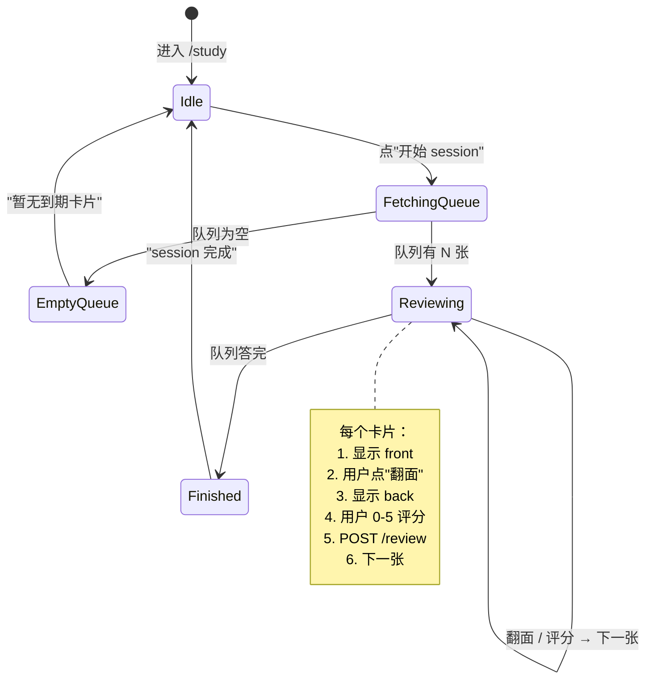
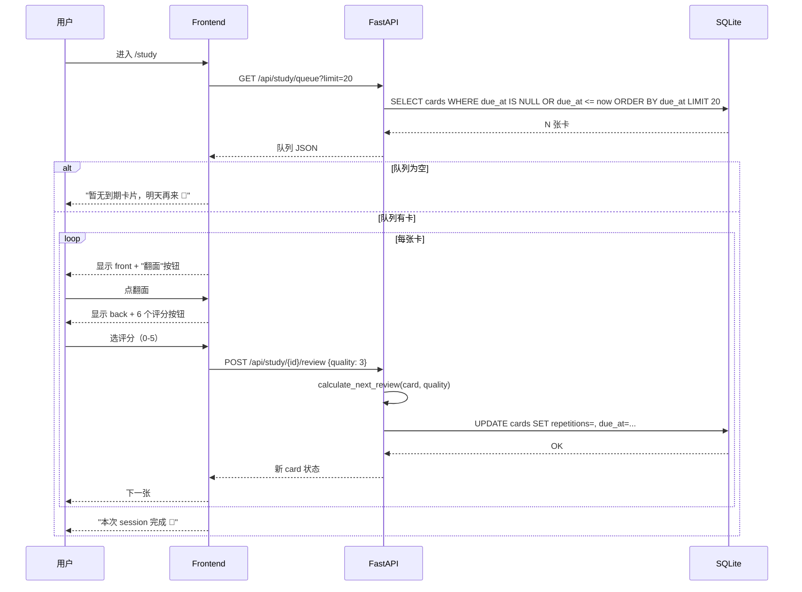

# 02 · Design Brief — 学习模式

> 这是 `examples/flashcards/Design-Brief.md` 的 Phase 2 章节。
> 视觉走的是 Element Plus 复用策略（无设计稿），本文聚焦**信息架构 + 状态机 + 反 UI 假设**。

---

## 1. 设计原则

按优先级（来自 Spec）：

1. **UI 一律以 Spec 为准**（无设计稿，继承 Phase 1 的 Element Plus 复用模式）
2. **3 分钟上手**：新用户 3 分钟内能完成第一次复习 session
3. **零认知负担**：不向用户暴露 SM-2 算法术语（"easiness" / "interval"），只暴露"答得怎样"

---

## 3. 信息架构

### 3.1 路由变化（从 Phase 1 增量）

```diff
  /                       → 首页 / 健康检查
  /cards                  → 卡片管理（CRUD）
+ /study                  → 学习首页（开始 session）
+ /study/session          → 单卡复习中
+ /study/stats            → 学习统计
```

### 3.2 学习 session 状态机



### 3.3 评分 UI（核心交互）

**反假设 1**（错的）：用 0-5 数字下拉框 — 用户不知道哪个数字代表"完美"。

**正确**：6 个 emoji 按钮（element-plus `el-radio-button` 强制）：

```
[😵 完全忘记]  [😕 答错]  [😐 答错·差点想出]
[🙂 通过1]    [😊 良好]   [🤩 完美]
   0           1           2
```

理由：用户认知负担 ↓ 90%。映射 SM-2 quality 0-5（用户不需知道 SM-2）。

---

## 4. 关键流程

### 4.1 复习 session 完整流程



### 4.2 学习统计页

```mermaid
flowchart LR
    StatsPage[学习统计页] --> FetchStats[GET /api/study/stats]
    FetchStats --> RenderCards[渲染：今日待复习 / 总卡片 / 已学过]
    RenderCards --> QuickStart[点"开始 session"]
    QuickStart --> StudyPage[跳 /study]
```

---

## 5. UI 假设 + 反假设

### 5.1 反假设 2（错的）：首页放"开始复习"大按钮

错：用户答完的卡不一定想继续复习。

**正确**：首页只显示 stats 摘要 + "开始复习"按钮在 `/study/stats` 顶部。

### 5.2 反假设 3（错的）：自动弹窗看哪种算法（SM-2 / FSRS）

错：用户不关心算法，只关心"我能记住更多吗"。

**正确**：算法不可选。技术选型在 05-decisions D-SM2-003 留底，用户无感知。

### 5.3 反假设 4（错的）：评分后立刻翻下一张

错：用户答错时想看反馈（"为什么我答错"）。

**正确**：评分后 1.5s 延迟再翻下一张，el-button 显示"答错，再来一次"。

---

## 6. 视觉规范（沿用 Phase 1）

- 库：Element Plus 2.8
- 组件复用：`el-card` / `el-button` / `el-radio-button` / `el-tag`
- 间距：统一 16px / 24px（Phase 1 已定）
- **不做任何新组件**，复用现有即可

理由：Design-Brief 第二性原则 — UI 不自由发挥。

---

## 7. 数据模型增量

```sql
ALTER TABLE cards ADD COLUMN repetitions INTEGER DEFAULT 0 NOT NULL;
ALTER TABLE cards ADD COLUMN interval INTEGER DEFAULT 0 NOT NULL;
ALTER TABLE cards ADD COLUMN easiness_factor FLOAT DEFAULT 2.5 NOT NULL;
ALTER TABLE cards ADD COLUMN due_at DATETIME;
ALTER TABLE cards ADD COLUMN last_reviewed_at DATETIME;
```

迁移策略：dev 环境 `main.py::lifespan` 启动时增量加列；
生产路径靠 Alembic（v1+ 再做）。

---

## 8. API 设计

| 方法 | 路径 | 入参 | 出参 |
|---|---|---|---|
| GET | `/api/study/queue` | `limit=20` | `List[CardStudyOut]` |
| POST | `/api/study/{card_id}/review` | `{quality: 0-5}` | `CardStudyOut` |
| GET | `/api/study/stats` | — | `{due_now, total, learned}` |

错误响应（统一）：

| 状态码 | 含义 |
|------|------|
| 404 | card_id 不存在 |
| 422 | quality 越界（Pydantic 拦截） |
| 500 | DB 错误（不暴露 detail） |

---

## 9. 可访问性 / i18n

- 评分按钮键盘可达：`Tab` + `1-6` 数字键
- 文案中文先放（v0 不做 i18n）
- `aria-label` 给 emoji 按钮（"完美回忆"）

<!-- owner: design -->