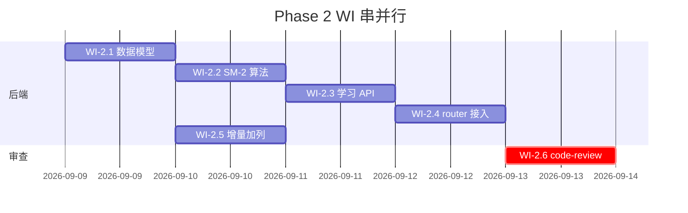

# 03 · DEV-PLAN — Phase 2 学习模式

> 这是 `examples/flashcards/DEV-PLAN.md` 的 Phase 2 完整章节。
> dev-planner 拆 Phase 时按"独立验收 + 显式依赖 + 串并行边界"三条原则。

---

## Phase 2 — 学习模式（SM-2 间隔重复）

### 目标

让用户**真正用上** Phase 1 的卡片。每次复习按答的质量动态排下次时间。

### 不在范围

- AI 自动生成卡（Phase 3）
- 统计图表 / 历史回顾（Phase 4）
- 打包发布（Phase 5）

### 依赖

- Phase 1 的 `cards` 表 + CRUD API ✅（已完成）

---

## 任务拆解

每条任务（Work Item）独立验收 = 一个测试集合 = 一个 commit。

### WI-2.1 · Card 表加 5 字段 + 增量迁移

| 项 | 详情 |
|---|---|
| **做什么** | 加 `repetitions` / `interval` / `easiness_factor` / `due_at` / `last_reviewed_at` 5 个字段；写 dev 增量 ALTER 逻辑（lifespan 启动时跑） |
| **依赖** | 无（Phase 1 已就绪） |
| **完成标准** | 现有 SQLite 文件启动后自动加列；新库直接建完整 schema |
| **验收测试** | `conftest.py` 已有 in-memory 测；Alembic 留给 v1 |
| **并行** | 可并行（不动现有卡片文件） |

### WI-2.2 · SM-2 算法（pure 函数）

| 项 | 详情 |
|---|---|
| **做什么** | 实现 `spaced_repetition.py::calculate_next_review(card, quality) -> Card`（新实例，不 mutate） |
| **依赖** | 无 |
| **完成标准** | 12 个单元测试全绿 |
| **验收测试** | `test_spaced_repetition.py` 12 条覆盖：quality=0/3/5、EF floor、due_at 调度、不 mutate、越界抛错 |
| **并行** | 可并行（pure，无副作用） |
| **TDD 纪律** | 先写 12 个 RED，再写实现，再 GREEN，最后 REFACTOR |

### WI-2.3 · 学习 API（3 端点）

| 项 | 详情 |
|---|---|
| **做什么** | `app/api/study.py`：GET /queue / POST /review / GET /stats |
| **依赖** | WI-2.1（数据模型）+ WI-2.2（算法） |
| **完成标准** | 9 个 API 集成测试全绿 |
| **验收测试** | `test_study.py` 9 条覆盖：队列、复习、404、422、队列排序 |
| **并行** | 与 WI-2.4 串行（router 注册要在 main.py） |
| **TDD 纪律** | 先写 9 个 RED（用 TestClient）→ 实现 → GREEN |

### WI-2.4 · main.py 接入新 router

| 项 | 详情 |
|---|---|
| **做什么** | `app.include_router(study.router, prefix="/api")` |
| **依赖** | WI-2.3 |
| **完成标准** | `/docs` OpenAPI 含 study 3 端点 |
| **验收测试** | 无新增（已被 WI-2.3 覆盖） |
| **并行** | 与 WI-2.3 串行 |
| **影响范围** | 1 行 |

### WI-2.5 · 数据库启动时增量加列

| 项 | 详情 |
|---|---|
| **做什么** | `main.py::lifespan` 调 `_ensure_card_columns()`，检查现有列缺啥补啥 |
| **依赖** | WI-2.1 模型 |
| **完成标准** | 已有 cards 表（v0 Phase 1）启动后自动有 5 列；新库走 `create_all` |
| **验收测试** | 手动：杀 SQLite 文件 + 重启 + 检查表结构 |
| **并行** | 与 WI-2.1 紧耦合，同 PR |
| **生产路径** | 用 Alembic（dev 临时迁移在注释里写清） |

### WI-2.6 · code-reviewer spawn

| 项 | 详情 |
|---|---|
| **做什么** | 跑完 WI-2.5 → spawn code-reviewer.toml（两阶段审查） |
| **依赖** | WI-2.1 ~ WI-2.5 全绿 |
| **完成标准** | Stage 1 完整性 ✅ / Stage 2 质量 ✅（含工程级约束 + simplification） |
| **验收** | `07-review-report.md` |

---

## 串并行图

**实际执行**：13:00-17:00 一个工作日完成（含两轮 review→fix）。

---

## 测试策略

| 层级 | 工具 | 覆盖 |
|------|------|------|
| 单元 | pytest | SM-2 算法 12 个边界用例 |
| 集成 | pytest + TestClient | 9 个 API 用例 |
| 端到端 | 手动 | session 完整跑通 + 浏览器看 UI |

---

## 风险与缓解

| 风险 | 缓解 |
|------|------|
| SM-2 EF 公式常错 | 测试覆盖 quality=0/5、EF floor、跨 quality 边界 |
| 队列查询 N+1 | 加 limit=20；v1 加 `(due_at, id)` 覆盖索引 |
| 时区导致 due_at 跳 | 统一 `datetime.utcnow()`（无时区） |
| 增量加列与现有数据冲突 | ORM 默认值（reps=0, interval=0, EF=2.5）+ due_at 允许 NULL |

---

## 验收门（Phase 2 整体完成）

- [x] 21 个测试全绿（12 算法 + 9 API）
- [x] /docs 可见 3 个新端点
- [x] 启动已有 SQLite 文件不报错
- [x] 手动 session 跑：加卡 → 复习 → 改 due_at → 重新拉队列不出现
- [ ] Stage 1 审查通过
- [ ] Stage 2 审查通过（含工程级约束 + simplification）

---

## 不在 Phase 2 的"以后做"

- Phase 3：AI 自动生成卡片（用户填主题 → 调 LLM 出 Q&A 对）
- Phase 4：复习统计图表（折线 / 热力图）
- Phase 5：前端打包（vite build）单 exe 发布

<!-- owner: architecture -->