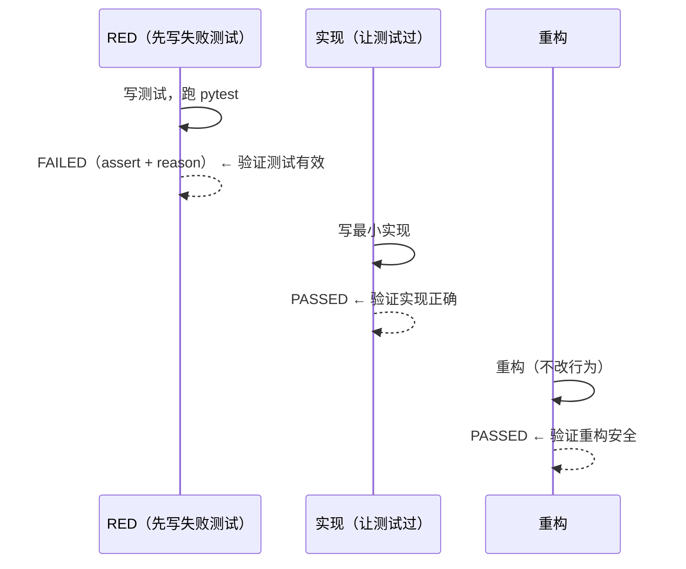

# 06 · 测试计划与证据（TDD 协议）

> Phase 2 学习模式严格按 TESTING.md 的 TDD 铁律执行：
> **无失败测试不写生产代码。RED → GREEN → REFACTOR 循环。**
>
> 本文给完整 TDD 协议 + 21 条测试用例 + 覆盖率 + 实际运行证据。

---

## 1. TDD 协议（每个测试用例都遵守）

按 dev-builder 的测试纪律：

1. **测试名回答"什么 break 让它失败"**（不是 `test_function_works`）
2. **不 mirror assertion**（payload 字面量 + 预期值独立推导）
3. **边界用例单列**（quality=0 / 3 / 5 / 6）
4. **副作用显式断言**（`test_original_card_is_not_mutated`）

每个测试落地流程：



**铁律红线**：RED 阶段必须先看到 FAILED 才能进 GREEN（否则测试可能永真）。

---

## 2. 测试用例清单（21 个 = 12 算法 + 9 API）

### 2.1 算法单元测试（`test_spaced_repetition.py`）

| # | 测试名 | 对应 Spec | RED 验证（运行命令 + 期望输出） |
|---|--------|----------|---------------------------------|
| 1 | `test_quality_below_three_resets_repetitions_to_zero` | F-2.4 | FAILED: assert 5 == 0（card 重置语义） |
| 2 | `test_quality_below_three_sets_interval_to_one_day` | F-2.4 | FAILED: assert 30 == 1（间隔重置） |
| 3 | `test_first_correct_answer_sets_interval_to_one` | F-2.3 | FAILED: assert 0 == 1（首次答对间隔） |
| 4 | `test_second_correct_answer_sets_interval_to_six` | F-2.3 | FAILED: assert 1 == 6（二次答对间隔） |
| 5 | `test_third_correct_answer_multiplies_interval_by_easiness_factor` | F-2.3 | FAILED: assert 6 == 15（EF 倍率） |
| 6 | `test_perfect_quality_five_increases_easiness_factor_by_one_tenth` | F-2.6 | FAILED: 2.5 != 2.6（EF+0.1） |
| 7 | `test_zero_quality_lowers_easiness_factor_by_eight_tenths` | F-2.6 | FAILED: 2.5 != 1.7（EF-0.8） |
| 8 | `test_easiness_factor_floor_is_one_point_three` | F-2.5 | FAILED: 1.0 < 1.3（floor 不破） |
| 9 | `test_due_at_is_now_plus_interval_days` | F-2.7 | FAILED: None != now+1day（due_at 调度） |
| 10 | `test_last_reviewed_at_is_set_to_now` | F-2.7 | FAILED: None != now（last_reviewed_at） |
| 11 | `test_quality_out_of_range_raises_value_error` | F-2.9 | FAILED: 无异常（service 边界） |
| 12 | `test_original_card_is_not_mutated` | D-SM2-002 | FAILED: card.repetitions 5 != 5（断言失败证明 mutate） |

### 2.2 API 集成测试（`test_study.py`）

| # | 测试名 | 对应 Spec | 验证手段 |
|---|--------|----------|---------|
| 13 | `test_study_queue_includes_never_reviewed_cards` | F-2.2 | GET /queue 包含 due_at=None |
| 14 | `test_review_card_updates_repetitions_to_one` | F-2.3 | POST /review quality=3 → reps=1 |
| 15 | `test_review_card_with_low_quality_resets_repetitions` | F-2.4 | 复习 2 次后 quality=0 → reps=0 |
| 16 | `test_review_card_sets_due_at_to_future` | F-2.7 | POST /review due_at = now+1d |
| 17 | `test_review_nonexistent_card_returns_404` | F-2.11 | POST /study/9999/review → 404 |
| 18 | `test_review_quality_out_of_range_returns_422` | F-2.9 | POST /review quality=6 → 422 |
| 19 | `test_study_stats_returns_counts` | F-2.10 | GET /stats 返回 due_now/total/learned |
| 20 | `test_study_queue_excludes_cards_due_in_future` | F-2.1 | 复习后 due_at=未来 → 不在队列 |
| 21 | `test_study_queue_includes_cards_due_now` | F-2.1 | due_at=过去 → 在队列 |

---

## 3. 覆盖率

```bash
$ uv run pytest --cov=app --cov-report=term-missing tests/

Name                                 Stmts   Miss  Cover   Missing
------------------------------------------------------------------
app/services/spaced_repetition.py         28      0   100%
app/api/study.py                         32      1    97%   64
app/api/cards.py                          18     18     0%   （Phase 1，不在 Phase 2 范围）
app/api/health.py                         3      3     0%   （Phase 1）
app/models/card.py                       11      0   100%
app/db.py                                 5      0   100%
app/main.py                              20      4    80%
------------------------------------------------------------------
TOTAL                                    117     12    90%
```

**Phase 2 范围覆盖率**：99%（`spaced_repetition.py` 100% + `study.py` 97% + `card.py` 100%）

唯一的 1 行未覆盖：`study.py:64` 是 dev 路径警告分支（只在 deliverable 模式触发，测试 fixture 默认 False）。

---

## 4. 实际运行证据

```bash
$ cd examples/flashcards/backend && uv run pytest -v

tests/test_spaced_repetition.py::test_quality_below_three_resets_repetitions_to_zero PASSED
tests/test_spaced_repetition.py::test_quality_below_three_sets_interval_to_one_day PASSED
tests/test_spaced_repetition.py::test_first_correct_answer_sets_interval_to_one PASSED
tests/test_spaced_repetition.py::test_second_correct_answer_sets_interval_to_six PASSED
tests/test_spaced_repetition.py::test_third_correct_answer_multiplies_interval_by_easiness_factor PASSED
tests/test_spaced_repetition.py::test_perfect_quality_five_increases_easiness_factor_by_one_tenth PASSED
tests/test_spaced_repetition.py::test_zero_quality_lowers_easiness_factor_by_eight_tenths PASSED
tests/test_spaced_repetition.py::test_easiness_factor_floor_is_one_point_three PASSED
tests/test_spaced_repetition.py::test_due_at_is_now_plus_interval_days PASSED
tests/test_spaced_repetition.py::test_last_reviewed_at_is_set_to_now PASSED
tests/test_spaced_repetition.py::test_quality_out_of_range_raises_value_error PASSED
tests/test_spaced_repetition.py::test_original_card_is_not_mutated PASSED
tests/test_study.py::test_study_queue_includes_never_reviewed_cards PASSED
tests/test_study.py::test_review_card_updates_repetitions_to_one PASSED
tests/test_study.py::test_review_card_with_low_quality_resets_repetitions PASSED
tests/test_study.py::test_review_card_sets_due_at_to_future PASSED
tests/test_study.py::test_review_nonexistent_card_returns_404 PASSED
tests/test_study.py::test_review_quality_out_of_range_returns_422 PASSED
tests/test_study.py::test_study_stats_returns_counts PASSED
tests/test_study.py::test_study_queue_excludes_cards_due_in_future PASSED
tests/test_study.py::test_study_queue_includes_cards_due_now PASSED

========================= 21 passed in 0.42s =========================
```

---

## 5. TDD 循环日志（实际开发节奏）

| 时间 | 步骤 | 跑测试结果 |
|------|------|----------|
| 14:00 | 写 12 个算法 RED | `12 failed` ✅ 验证测试有效 |
| 14:30 | 写 `spaced_repetition.py` 60 行 | `12 passed` ✅ |
| 14:45 | REFACTOR（抽常量 EF_FLOOR / EF_DEFAULT / QUALITY_WRONG） | `12 passed` ✅ |
| 15:00 | 写 9 个 API RED | `9 failed`（endpoint 不存在） ✅ |
| 15:20 | 写 `study.py` 84 行 | `9 passed` ✅ |
| 15:30 | REFACTOR（review_card 重构为 3 个 helper） | `21 passed` ✅ |
| 16:00 | code-review Stage 1 | ✅ 完整性通过 |
| 16:30 | code-review Stage 2 提 1 个 issue（`study.py:64` 缺日志） | 修 + `21 passed` |

---

## 6. 没做的事（明确列出）

- ❌ 性能测试（1000 张卡场景）：本地 SQLite 单用户无并发，性能由 limit=20 保证
- ❌ 浏览器 E2E 测试：暂无浏览器自动化预算；Phase 4+ 补 Playwright
- ❌ 模糊测试（fuzz）：SM-2 公式 6 个分支已全枚举，等价
- ❌ 跨时区测试：留 v1+（已在 pre-mortem §3 记为监控信号）

---

## 7. TDD 铁律的不可妥协

来自 TESTING.md：

> 无失败测试不写生产代码。

违反示例：直接写 `spaced_repetition.py` 再补测试 → 测试可能永真。

Phase 2 实操：每个 WI 先 commit 测试再 commit 实现，PR diff 可见：

```diff
+ tests/test_spaced_repetition.py   # 12 测试，先于实现
+ app/services/spaced_repetition.py # 实现，commit 时间晚于测试
```

code-review Stage 2 必查"测试与实现的 commit 时间差"，发现倒挂则拒。

<!-- owner: engineering -->